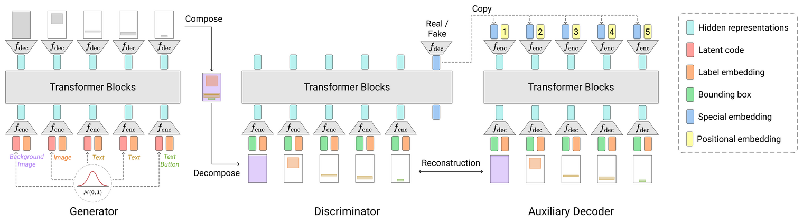
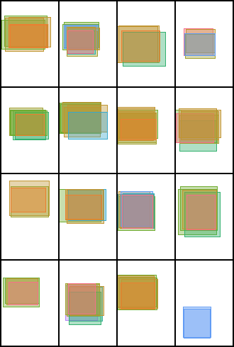
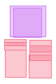

# [MM'21] Constrained Graphic Layout Generation via Latent Optimization

This repository provides the official code for the paper "Constrained Graphic Layout Generation via Latent Optimization", especially the code for:

-   **LayoutGAN++**: generative adversarial networks for layout generation
-   **CLG-LO**: a framework for generating layouts that satisfy constraints
-   **Layout evaluation**: measuring the quantitative metrics of _Layout FID_, _Maximum IoU_, _Alignment_, and _Overlap_ for generated layouts

## Installation

1. Clone this repository

    ```bash
    git clone https://github.com/ktrk115/const_layout.git
    cd const_layout
    ```

2. Create a new [conda](https://docs.conda.io/en/latest/miniconda.html) environment (Python 3.8)

    ```bash
    conda create -n const_layout python=3.8
    conda activate const_layout
    ```

3. Install [PyTorch 1.8.1](https://pytorch.org/get-started/previous-versions/#v181) and [PyTorch Geometric 1.7.2](https://pytorch-geometric.readthedocs.io/en/latest/notes/installation.html#installation-via-pip-wheels). An example of the PyG installation command is shown below.

    ```bash
    pip install torch-scatter==2.0.7 -f https://data.pyg.org/whl/torch-1.8.1+cu111.html
    pip install torch-sparse==0.6.10 -f https://data.pyg.org/whl/torch-1.8.1+cu111.html
    pip install torch-geometric==1.7.2
    ```

4. Install the other dependent libraries

    ```bash
    pip install -r requirements.txt
    ```

5. Prepare data (see [this instruction](data/))

6. Download pre-trained models

    ```bash
    ./download_model.sh
    ```
    
7. Install [ImageMagick](https://imagemagick.org/) for visualization


## Development environment

-   Ubuntu 18.04, CUDA 11.1

## LayoutGAN++

Architecture  


Training animation  


### Generate layouts with LayoutGAN++

```bash
python generate.py pretrained/layoutganpp_rico.pth.tar --out_path output/generated_layouts.pkl --num_save 5
```

### Train LayoutGAN++ model

```bash
python train.py --dataset rico --batch_size 64 --iteration 200000 --latent_size 4 --lr 1e-05 --G_d_model 256 --G_nhead 4 --G_num_layers 8 --D_d_model 256 --D_nhead 4 --D_num_layers 8
```

## CLG-LO

|                        w/ beautification constraints                        |                          w/ relational constraints                          |
| :-------------------------------------------------------------------------: | :-------------------------------------------------------------------------: |
|   |   |

### Generate layouts with beautification constraints

```bash
python generate_const.py pretrained/layoutganpp_publaynet.pth.tar --const_type beautify --out_path output/beautify/generated_layouts.pkl --num_save 5
```

### Generate layouts with relational constraints

```bash
python generate_const.py pretrained/layoutganpp_publaynet.pth.tar --const_type relation --out_path output/relation/generated_layouts.pkl --num_save 5
```

## Layout evaluation

### Evaluate generated layouts

```bash
python eval.py rico output/generated_layouts.pkl
```

A pickle file should be a list of layouts, where each layout is a tuple of bounding boxes and labels. The bounding box is represented by [x, y, width, height] in normalized coordinates, and the label is represented by an index. An example is shown below.

```
In [x]: layouts
Out[x]:
[(array([[0.47403812, 0.11276676, 0.6250037 , 0.02210438],
         [0.49971417, 0.8550553 , 0.81388366, 0.03492427],
         [0.49919674, 0.47857162, 0.81024694, 0.7070079 ]], dtype=float32),
  array([0, 0, 3]),
  ...
```

## Citation

If this repository helps your research, please consider citing our [paper](https://doi.org/10.1145/3474085.3475497).

```bibtex
@inproceedings{Kikuchi2021,
    title = {Constrained Graphic Layout Generation via Latent Optimization},
    author = {Kotaro Kikuchi and Edgar Simo-Serra and Mayu Otani and Kota Yamaguchi},
    booktitle = {ACM International Conference on Multimedia},
    series = {MM '21},
    year = {2021},
    pages = {88--96},
    doi = {10.1145/3474085.3475497}
}
```

## Licence

GNU AGPLv3

## Related repositories

-   https://github.com/JiananLi2016/LayoutGAN-Tensorflow
-   https://github.com/alexandre01/deepsvg
